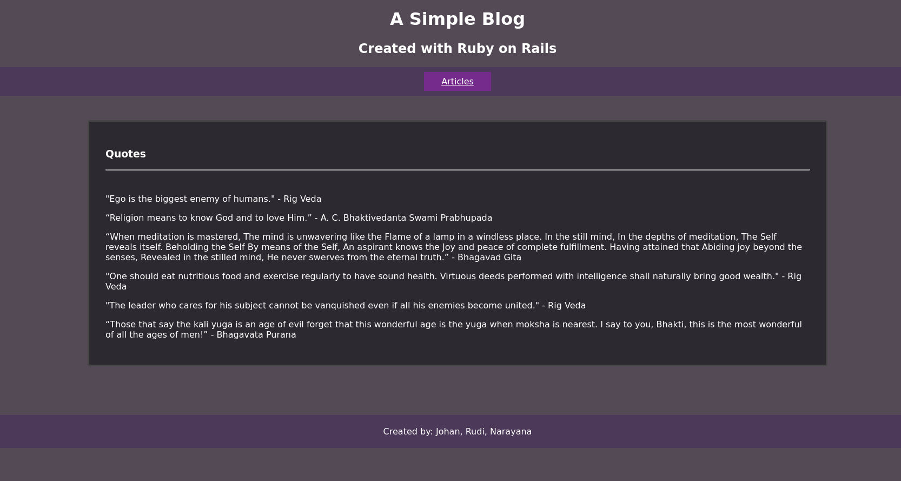
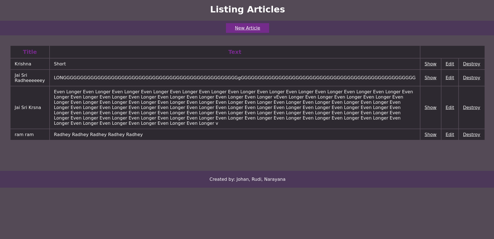
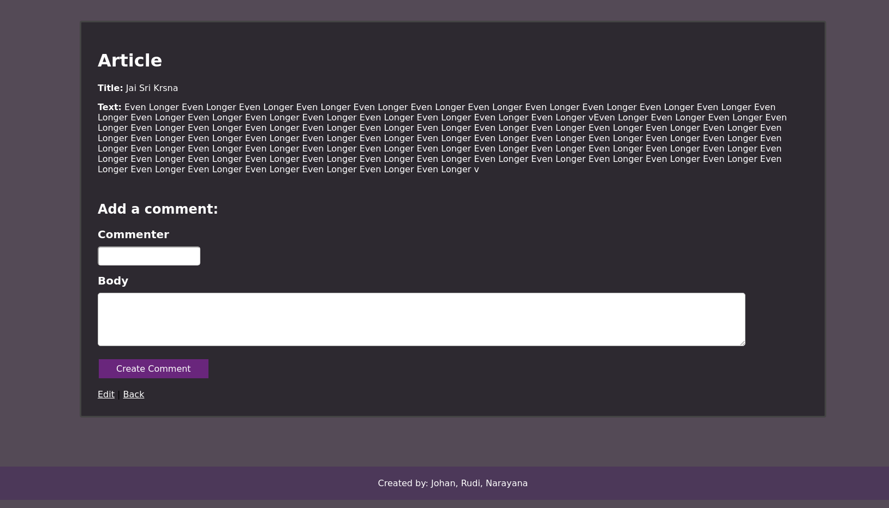

# Rails Blog 
[Blog Tutorial](https://guides.rubyonrails.org/getting_started.html)

# Preview





# Dependencies
 
- Ruby version: `2.7.1`
- `gem install rails -v 6.0.2` 
- Database: `sqlite3`


# Commands
 
### Start server
- `rails server`

### Database initialization
- `rails db:schema:load`

### Migrate Database
- `rails db:migrate`

### Drop Database
- `rails db:drop`

### Rails console
```sh
$ rails console
Article.all
Comment.all
```

### Rails dbconsole
```sh
$ rails dbconsole
.schema articles
SELECT "articles".- FROM "articles";
.tables
```

### How to run the test suite
- To Do


# Documentation
- [Rails Guide](https://guides.rubyonrails.org/) 
- [API Reference](https://api.rubyonrails.org/v6.0.3.1/)
